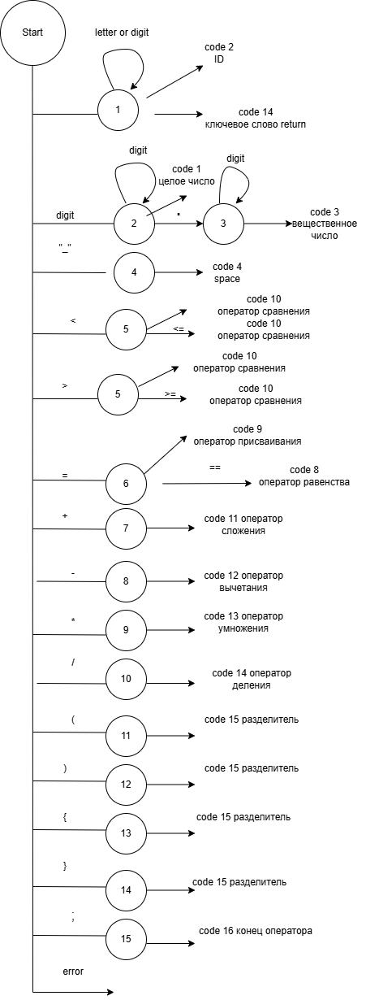
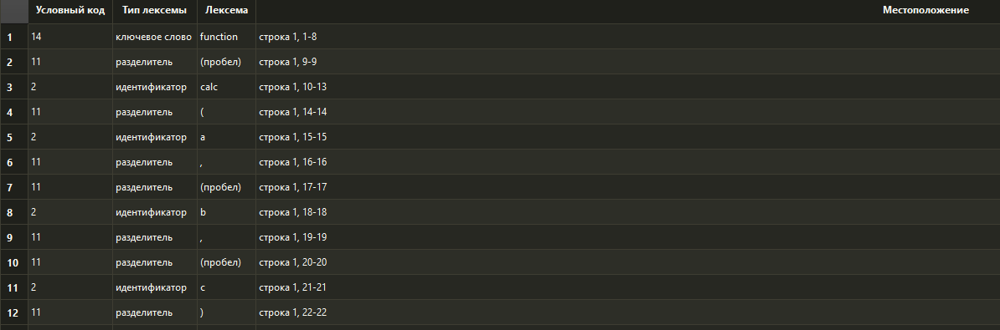
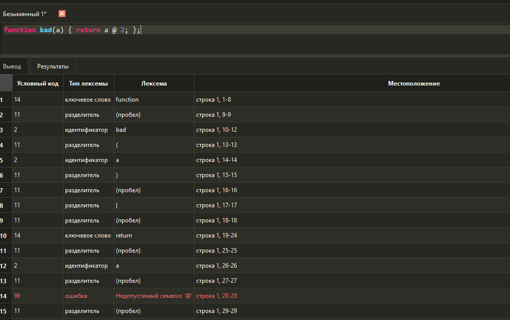
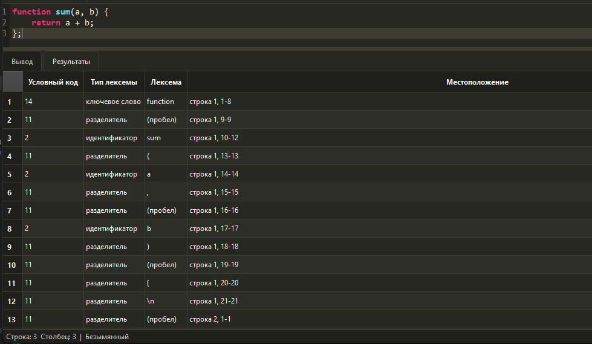

# Лабораторная работа №2: Разработка лексического анализатора

## 1. Цель работы

Изучить назначение и принципы работы лексического анализатора в структуре компилятора. Спроектировать алгоритм конечного автомата и выполнить программную реализацию сканера для выделения лексем из входного текста.

## 2. Автор

- **Студент:** Костюк Кирилл
- **Дата выполнения:** Март 2026
- **Вариант:** Создание функций JS

## 3. Постановка задачи

Необходимо разработать лексический анализатор для индивидуального варианта, интегрировать его в приложение из лабораторной работы №1 и обеспечить вывод результатов в табличном виде.

Сканер должен:

- принимать исходный текст программы;
- выделять допустимые лексемы;
- классифицировать лексемы по типам;
- обнаруживать недопустимые символы;
- указывать местоположение каждой лексемы и ошибки;
- учитывать многострочный входной текст.

## 4. Вариант задания

**Вариант:** создание функции языка JavaScript.

Пример исходной конструкции:

```javascript
function calc(a, b, c) {
    return a + (b * c);
};
```

Корректные входные строки:

```javascript
function calc(a, b, c) { return a + (b * c); };
```

```javascript
function sum(a, b) {
    return a + b;
};
```

```javascript
function $calc_1(x) { return x * 10; };
```

```javascript
function compare(a, b) { return a >= b; };
```

## 5. Допустимые лексемы

| Условный код | Тип лексемы | Описание | Примеры |
| --- | --- | --- | --- |
| 1 | целое без знака | Последовательность цифр | `10`, `123` |
| 2 | идентификатор | Имя функции, параметра или переменной. Первый символ: латинская буква, `_` или `$`; далее также разрешены цифры | `calc`, `a`, `$calc_1` |
| 3 | вещественное число | Целая и дробная часть, разделенные точкой | `10.5`, `123.45` |
| 10 | оператор | Арифметический оператор, присваивание или оператор сравнения | `+`, `-`, `*`, `/`, `=`, `==`, `!=`, `>=`, `<=`, `+=`, `-=`, `*=`, `/=`, `>`, `<` |
| 11 | разделитель | Скобки, запятая и пробельные символы | `(`, `)`, `{`, `}`, `,`, пробел, табуляция, перевод строки |
| 14 | ключевое слово | Зарезервированное слово варианта | `function`, `return` |
| 16 | конец оператора | Точка с запятой | `;` |
| 99 | ошибка | Недопустимый символ или некорректная лексема | `@`, `привет`, `1abc` |

Строки и комментарии не входят в набор допустимых лексем для данной лабораторной работы. Идентификаторы ограничены латинскими буквами, цифрами, символами `_` и `$`, поэтому русские буквы считаются ошибкой.

## 6. Диаграмма состояний



Описание работы автомата:

1. В состоянии `START` анализатор выбирает дальнейшее состояние по текущему символу.
2. Если символ является началом идентификатора, автомат переходит в состояние `1` и считывает имя до первого неподходящего символа.
3. После завершения чтения идентификатора значение сравнивается с ключевыми словами `function` и `return`; если совпадения нет, формируется идентификатор.
4. Если символ является цифрой, автомат переходит в состояние `2` и считывает целое число.
5. Если после цифр встречается точка и за ней идет цифра, автомат формирует вещественное число.
6. Если после числа встречается латинская буква, `_` или `$`, формируется ошибка некорректного идентификатора, начинающегося с цифры.
7. Операторы, разделители, точка с запятой и пробельные символы формируют отдельные лексемы.
8. Любой другой символ формирует лексему типа `ошибка`.

## 7. Интеграция с интерфейсом

Логика анализа вынесена в отдельный файл `scanner.py`. Класс `LexicalAnalyzer` содержит метод `analyze(text)`, который принимает строку исходного текста и возвращает список лексем и список ошибок.

В интерфейсе приложения кнопка **Пуск** на панели инструментов и пункт меню **Запуск -> Запуск анализа** вызывают один метод анализа. Перед каждым запуском старые результаты очищаются.

Таблица результатов содержит столбцы:

- **Условный код**;
- **Тип лексемы**;
- **Лексема**;
- **Местоположение**.

При щелчке по строке с ошибкой курсор в области редактирования устанавливается на позицию недопустимого символа.

Выделенные строки таблицы результатов можно скопировать в буфер обмена с помощью `Ctrl+C`.

## 8. Тестовые примеры

### 8.1. Корректная строка

Вход:

```javascript
function calc(a, b, c) { return a + (b * c); };
```

Фрагмент ожидаемой последовательности:

| Условный код | Тип лексемы | Лексема | Местоположение |
| --- | --- | --- | --- |
| 14 | ключевое слово | `function` | строка 1, 1-8 |
| 11 | разделитель | `(пробел)` | строка 1, 9-9 |
| 2 | идентификатор | `calc` | строка 1, 10-13 |
| 11 | разделитель | `(` | строка 1, 14-14 |
| 2 | идентификатор | `a` | строка 1, 15-15 |
| 11 | разделитель | `,` | строка 1, 16-16 |
| 11 | разделитель | `(пробел)` | строка 1, 17-17 |
| 2 | идентификатор | `b` | строка 1, 18-18 |
| 16 | конец оператора | `;` | строка 1, 47-47 |

Скриншот корректного примера :



### 8.2. Строка с недопустимым символом

Вход:

```javascript
function bad(a) { return a @ 2; };
```

Ожидаемый результат: символ `@` будет выведен как ошибка.

| Условный код | Тип лексемы | Лексема | Местоположение |
| --- | --- | --- | --- |
| 99 | ошибка | `Недопустимый символ: '@'` | строка 1, 28-28 |


Скриншот примера с ошибкой:



### 8.3. Многострочный пример

Вход:

```javascript
function sum(a, b) {
    return a + b;
};
```

Ожидаемый результат: перевод строки `\n` и пробелы в начале второй строки будут выведены как лексемы-разделители, а номера строк в местоположении будут изменяться при переходе на новую строку.

| Условный код | Тип лексемы | Лексема | Местоположение |
| --- | --- | --- | --- |
| 14 | ключевое слово | `function` | строка 1, 1-8 |
| 2 | идентификатор | `sum` | строка 1, 10-12 |
| 11 | разделитель | `\n` | строка 1, 21-21 |
| 14 | ключевое слово | `return` | строка 2, 5-10 |
| 11 | разделитель | `\n` | строка 2, 18-18 |
| 11 | разделитель | `}` | строка 3, 1-1 |
| 16 | конец оператора | `;` | строка 3, 2-2 |

Скриншот многострочного примера:


